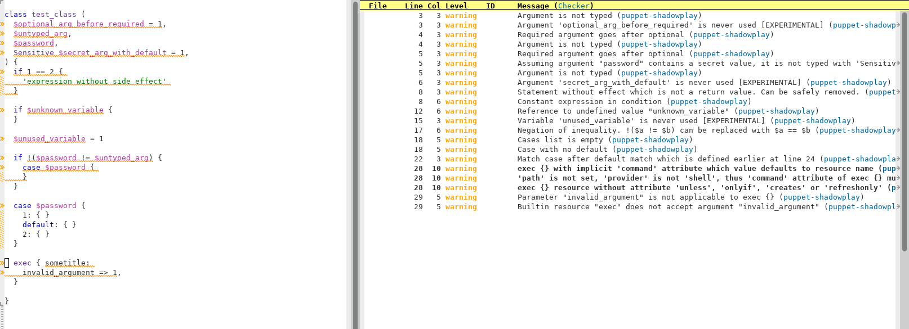

# Table of Contents

1.  [About](#orga2cc313)
2.  [Installation methods](#org3094443)
    1.  [Via deb/rpm](#orgec152af)
    2.  [MaOS binaries](#org1af410c)
    3.  [Via cargo](#org27a8048)
    4.  [Guix manifest](#orgdbe2b2e)
3.  [Usage](#org8310e38)
    1.  [Correctness of YAML files](#org3e2380d)
    2.  [Validity of Hiera YAML files](#orgb693b4c)
    3.  [Linter of Puppet manifest files](#orga6d5b05)
    4.  [Pretty printing manifest file](#org37fd1b6)
    5.  [Config file generator](#org66bd44e)
    6.  [Hiera explorer](#org0522aa5)
    7.  [\*.pp AST dumper](#orga2440c8)
4.  [Available lints for \*.pp](#orgcc45924)
    1.  [ArgumentLooksSensitive](#org09e52bf)
    2.  [ArgumentTyped](#orgfd69526)
    3.  [ConstantExpressionInCondition](#orga6bfced)
    4.  [DefaultCaseIsNotLast](#orge6e8126)
    5.  [DoNotUseUnless](#org30bf82f)
    6.  [DoubleNegation](#orgac45a11)
    7.  [EmptyCasesList](#org6ee77a7)
    8.  [EnsureAttributeIsNotTheFirst](#org54afeaf)
    9.  [ErbReferencesToUnknownVariable](#orgfa5407a)
    10. [ExecAttributes](#org1047a12)
    11. [ExpressionInSingleQuotes](#org73ea0fe)
    12. [FileModeAttributeIsString](#org283f6da)
    13. [InvalidResourceCollectionInvocation](#org52168c4)
    14. [InvalidResourceSetInvocation](#org838c5f4)
    15. [InvalidStringEscape](#org8c9eacf)
    16. [InvalidVariableAssignment](#org1159ad7)
    17. [LowerCaseArgumentName](#orgbfb004a)
    18. [LowerCaseVariable](#org16643b3)
    19. [MultipleDefaultCase](#orgdf38d26)
    20. [MultipleResourcesWithoutDefault](#org4d5bbb6)
    21. [NegationOfEquation](#org6d1cfee)
    22. [NoDefaultCase](#org45560fa)
    23. [OptionalArgumentsGoesFirst](#org1542b1e)
    24. [PerExpressionResourceDefaults](#org32f24ae)
    25. [ReadableArgumentsName](#org356d0ea)
    26. [ReferenceToUndefinedValue](#orgc5bafa4)
    27. [RelationToTheLeft](#orge3d08b3)
    28. [SelectorInAttributeValue](#orgb686d58)
    29. [SensitiveArgumentWithDefault](#org7a468ac)
    30. [StatementWithNoEffect](#org3ea19f3)
    31. [UnconditionalExec](#org528d489)
    32. [UniqueArgumentsNames](#org0acef8d)
    33. [UniqueAttributeName](#org691b97a)
    34. [UnusedVariables](#org95c2a68)
    35. [UpperCaseName](#org0e7661b)
    36. [UselessDoubleQuotes](#orgfea6aa7)
    37. [UselessParens](#orgf82e96d)
    38. [MagicNumber](#org573c161)
    39. [TooManyArguments](#org9caa8ae)
    40. [HugeCodeBlock](#orgd4ff2ac)
    41. [DeepCode](#org5d015f7)
5.  [Linter for YAML files](#orgddb45e6)
6.  [Linter for Hiera YAML files](#org14b677d)
    1.  [Reference to a module which has syntax errors](#org5ddbd54)
    2.  [Reference to class which is not found in modules/](#orge57d680)
    3.  [Reference in undefined class argument](#orga5f7f0a)
    4.  [Single column in the name of key of root map](#org8ae45c0)

# About

Shadowplay is a utility for checking puppet syntax, a puppet manifest linter, a pretty printer, and a utility for exploring the Hiera.

# Installation methods

## Via deb/rpm

Latest releases can be downloaded here: <https://github.com/mailru/shadowplay/releases>

## MaOS binaries

Lastest binaries for MacOS can be downloaded here: <https://github.com/mailru/shadowplay/releases>

## Via cargo

    cargo install shadowplay

## Guix manifest

Guix manifest is not merged into main repository yet. One can use etc/guix.scm from Shadowplay repo. All missing dependencies are also
included into manifest file.

# Usage

## Correctness of YAML files

    shadowplay check yaml hieradata/default.yaml [hieradata/another.yaml] ...

In addition to the correctness of the syntax, the uniqueness of the keys in maps will be checked, as well as the correctness of the links
(anchors).

## Validity of Hiera YAML files

    shadowplay check hiera hieradata/default.yaml ...

For the specified files, YAML correctness will be checked, as well as the correctness of references to Puppet classes and class arguments.
For example, there will be an error generated if an unknown class argument is used.

As a side effect, it also checks the correctness of syntax of pappet manifests referenced by values ​​in Hiera.

## Linter of Puppet manifest files

    shadowplay --repo-path ./ check pp modules/hammer/manifests/config.pp ...

The specified files will be processed by the parser, then linter checks will be applied to the resulting AST (if parsing is successful).

## Pretty printing manifest file

    shadowplay pretty-print-pp < /path/to/file.pp

## Config file generator

Use may want to disable some lints or customize it. She can generate default config and edit it later with the command:

    shadowplay generate-config >/etc/shadowplay.yaml

## Hiera explorer

Hiera is hierarchy of yaml files. In huge configurations it may be difficult to determine value of specific key for some host. Shadowplay
provides easy solution.

    shadowplay get host123 sshd::install::version

Command prints as much information as possible:

    Value: "present"
    Found in "./hieradata/default_CentOS7.yaml" at lines 63:63
    Value lookup path was: network/host123.yaml -> host123.yaml -> host.yaml -> default_CentOS7.yaml
    ===================================
    Git information:
    deadbeef1234 (Evgenii Lepikhin 2022-03-29 15:06:51 +0300 63) sshd::install::version:             'present'

## \*.pp AST dumper

    shadowplay dump modules/sshd/manifests/install.pp

Outputs AST in JSON format. Mainly for internal purposes.

# Available lints for \*.pp

## ArgumentLooksSensitive

Warns if argument name looks like sensitive, but argument is not typed with type Sensitive

Bad:

    class some::class (
      $secret_token,
    ) { }

Good:

    class some::class (
      Sensitive $secret_token,
    ) { }

## ArgumentTyped

Warns if argument is not typed

Bad:

    class some::class (
      $config_path,
    ) { }

Good:

    class some::class (
      Stdlib::Absolutepath $config_path,
    ) { }

## ConstantExpressionInCondition

Warns if constant expression is used in condition

Bad:

    if 1 == 2 - 1 { notify('1=2-1') }

Such type of conditions always evaluated into constant false or true, thus can be safely removed. Good:

    notify('1=2-1')

## DefaultCaseIsNotLast

Warns if 'default' case is not the last

Bad:

    case $value {
      'a': { }
      default: { }
      'b': { }
    }

Good:

    case $value {
      'a': { }
      'b': { }
      default: { }
    }

## DoNotUseUnless

Warns if 'unless' conditional statement is used

Bad:

    unless $value { }

Good:

    if !$value { }

## DoubleNegation

Warns if double negation is used

Bad:

    if !(!$value) { }
    
    if !($value != 1) { }

Good:

    if $value { }
    
    if $value == 1 { }

## EmptyCasesList

Warns if case { &#x2026; } has no cases

Bad:

    case $value { }

## EnsureAttributeIsNotTheFirst

Warns if 'ensure' argument of resource is not the first

Bad:

    file { '/etc/passwd':
      user => root,
      ensure => file,
    }

Good:

    file { '/etc/passwd':
      ensure => file,
      user => root,
    }

## ErbReferencesToUnknownVariable

Checks ERB templates specified in template() for undefined variables

Bad:

    class some::class () {
      # here template_file.erb contains: <% @some_undefined_variable %>
      $value = template('some/template_file.erb')
    }

## ExecAttributes

Checks exec { &#x2026;} arguments

Bad:

    # implicit 'command' attribute
    exec { 'echo Hello' : }
    
    exec {
      unknown_attribute => 1,
    }
    
    # invalid provider
    exec {
      provider => 'unknown provider value'
    }
    
    # 'path' is not set, 'provider' is not 'shell', thus 'command' attribute of exec {} must start with absolute path
    exec {
      command => 'echo Hello'
    }

## ExpressionInSingleQuotes

Warns if interpolated expression found single-qouted string

Bad:

    $value = 'Hello $world'
    
    $value = '2 + 2 = ${2+2}'

## FileModeAttributeIsString

Warns if argument 'mode' of 'file' resource is not in 4-digit string form

Bad:

    file { '/some/file':
      mode => '644',
    }
    
    file { '/some/file':
      mode => 644,
    }

Good:

    file { '/some/file':
      mode => '0644',
    }

## InvalidResourceCollectionInvocation

Checks if existing resource set is used and all arguments are known in it's class

Bad:

    # relation to unknown resource
    Class['unknown_class'] -> Class['known_class']

## InvalidResourceSetInvocation

Checks if existing resource is used and all arguments are known in it's class

Bad:

    class class1 (
      $known_arg,
    ) { }
    
    class class2 {
      # Call to unknown class
      class { 'unknown_class': }
    
      # Call to known class with invalid argument
      class { 'class1':
        unknown_arg => 1
      }
    
      # Call to known class with invalid argument
      class1 { 'title':
        unknown_arg => 1,
      }
    
      # Call to internal resource with invalid argument
      file { '/some/file':
        uknown_arg => 1,
      }
    }

## InvalidStringEscape

Checks if only allowed characters are escaped in strings

Bad:

    $value = '\s*\.'
    
    $value = "\s*\."

Good:

    $value = '\\s*\\.'
    
    $value = "\\s*\\."

## InvalidVariableAssignment

Warns if left part of assignment is not a variable or array of variables

Bad:

    lookup('some::value') = 1

## LowerCaseArgumentName

Warns if argument name is not lowercase, as suggested by Puppet's style guide

Bad:

    class some::class (
      $ArgumentInCamelCase
    ) {}

## LowerCaseVariable

Warns if variable name is not lowercase

Bad:

    class some::class () {
      $VariableIsNOTInLowercase = 1

## MultipleDefaultCase

Warns if case statement has multiple 'default' cases

Bad:

    case $val {
      1: {}
      default: {}
      default: {}
    }

## MultipleResourcesWithoutDefault

Warns if resource set contains multiple resources and no defaults specified

Bad:

    file {
      '/etc/passwd':
        ensure => file,
        user => root,
      '/etc/group':
        ensure => file,
        user => root,
        group => wheel,
    }

Good:

    file {
      default:
        ensure => file,
        user => root,
      '/etc/passwd':
      '/etc/group':
        group => wheel,
    }

## NegationOfEquation

Warns on negation of equation

Bad:

    if !($a == 1) { }
    
    if !($a =~ /./) { }

Good:

    if $a != 1 { }
    
    if $a !~ /./ { }

## NoDefaultCase

Warns if case statement has no default case

Bad:

    case $val {
      1, 2: {  }
      3: { }
    }

Good:

    case $val {
      1, 2: {  }
      3: { }
      default: { }
    }

## OptionalArgumentsGoesFirst

Warns if optional argument specified before required

    class some::class (
      $optional_arg = 1,
      $required_arg,
    ) { }

Good:

    class some::class (
      $required_arg,
      $optional_arg = 1,
    ) { }

## PerExpressionResourceDefaults

Warns if local resource defaults are used

Bad:

    Exec {
      provider => shell,
    }
    
    exec { 'run command':
      command => 'echo Hello',
    }

## ReadableArgumentsName

Warns if argument name is not readable enough

Bad:

    class some::class (
      String $c = '/etc/config',
    ) { }

Good:

    class some::class (
      String $config = '/etc/config',
    ) { }

## ReferenceToUndefinedValue

Warns if variable is not defined in current context

Bad:

    if $some_undefined_variable { }

## RelationToTheLeft

Checks for left-directed relations

Bad:

    Class['c'] <- Class['b'] <~ Class['a']

Good:

    Class['a'] ~> Class['b'] -> Class['c']

## SelectorInAttributeValue

Warns if selector (&#x2026; ? &#x2026; : &#x2026;) used in resource attribute

Bad:

    file { '/etc/shadow':
      mode => $is_secure ? '0600' : '0644',
    }

Good:

    $file_mode = $is_secure ? '0600' : '0644'
    
    file { '/etc/shadow':
      mode => $file_mode,
    }

## SensitiveArgumentWithDefault

Warns if argument typed with Sensitive contains default value

Bad:

    class some::class (
      Sensitive $password = 'admin',
    )

Public available default value for sensitive data is nonsense. Good:

    class some::class (
      Sensitive $password,
    )

## StatementWithNoEffect

Checks for statements without side effects

Bad:

    if $a {
      if $b {
        2 + 2
      }
    }

## UnconditionalExec

Warns if exec { &#x2026; } is specified without unless, onlyif, creates or refreshonly attributes

Bad:

    exec { 'run command':
      command => '/bin/rm -rf /var/cache/myapp',
    }

Good:

    exec { 'run command':
      command => '/bin/rm -rf /var/cache/myapp',
      onlyif => 'test -e /var/cache/myapp',
    }

## UniqueArgumentsNames

Checks for class/definition/plan arguments uniqueness

Bad:

    class some::class (
      $arg,
      $arg,
      $arg,
    ) { }

## UniqueAttributeName

Resource attributes must be unique

Bad:

    service { 'sshd':
      ensure => running,
      ensure => stopped,
    }

## UnusedVariables

Checks for unused variables. Experimental lint false-positives are possible.

Bad:

    class some::class (
      $unused_argument,
    ) {
      service { 'sshd':
        ensure => running,
      }
    }

## UpperCaseName

Warns if resource set used with uppercase letters

Bad:

    Service { 'sshd':
      ensure => running,
    }

Good:

    service { 'sshd':
      ensure => running,
    }

## UselessDoubleQuotes

Warns if double quoted string has no interpolated expressions and no escaped single quotes

Bad:

    $var = "simple literal"

Good:

    $var = 'simple literal'

## UselessParens

Checks for extra parens

Bad:

    if (($var1) or ($var2)) { }

Good:

    if $var1 or $var2 { }

## MagicNumber

Warns if term contains magic number.

Bad:

    if $port == 58271 { }

Good:

    $default_service_port = 58271
    
    if $port == $default_service_port { }

## TooManyArguments

Warns if class or definition accepts too many arguments.

## HugeCodeBlock

Points to too long statements lists.

## DeepCode

Alerts on too deep code blocks.

# Linter for YAML files

Some basic checks are implemented:

-   File is not executable
-   File is empty (no root value available)
-   File parsed without syntax errors
-   Maps does not contain duplicate keys
-   Attempt to merge anchor which type is not array nor map

# Linter for Hiera YAML files

All lints of YAML files plus:

## Reference to a module which has syntax errors

Linter will fail if someclass was unable to parse:

    some_class::argument: 1

## Reference to class which is not found in modules/

Linter will fail if modules/someclass/init.pp does not exists:

    some_class::argument: 1

## Reference in undefined class argument

Linter will fail if someclass does not accept argument $argumentname:

    some_class::argument_name: 1

## Single column in the name of key of root map

Linter protects agains typos like:

    some_class:argument_name: 1

